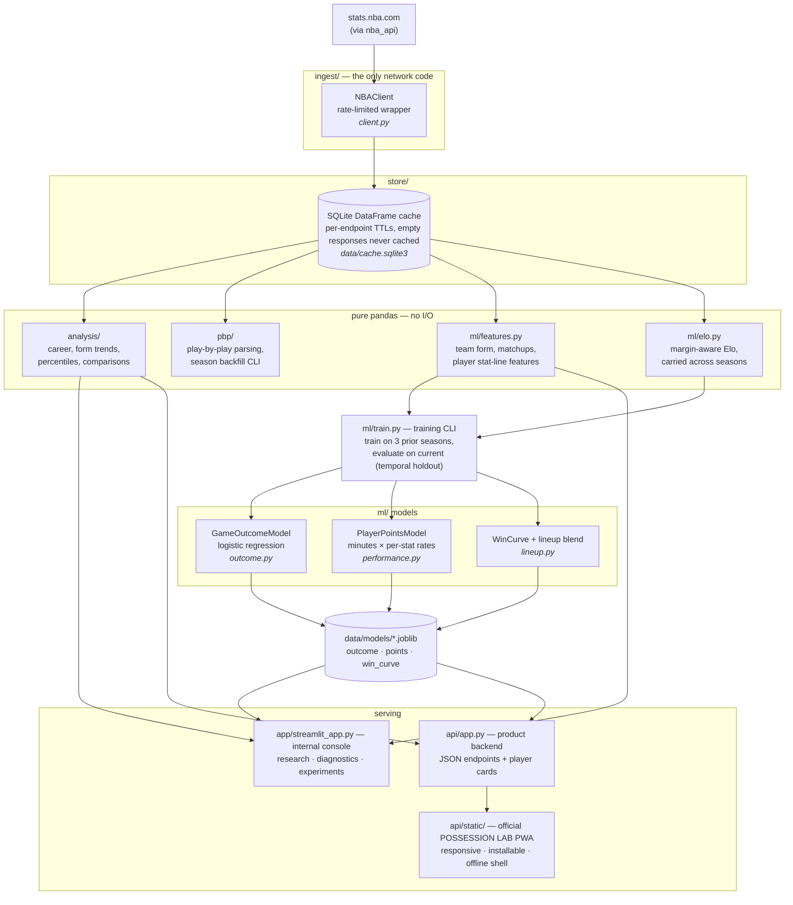

# Architecture

## Product boundary

The FastAPI-served PWA is the official POSSESSION LAB product. Streamlit is an
internal research and diagnostics console; it may expose experiments but does
not carry a public feature-parity requirement. The decision and transition
policy are recorded in [PRODUCT_SURFACES.md](PRODUCT_SURFACES.md).

One rule holds everywhere: **the network is touched in exactly one place**
(`ingest.NBAClient`), every fetch goes through the SQLite cache, and
everything downstream of the cache is pure pandas — which is why the whole
test suite runs offline.

## Layer contracts

| Layer | Contract |
|---|---|
| `ingest/` | The **only** code that touches the network. Rate-limited `nba_api` wrapper; never called directly by the app layer. |
| `store/` | `Cache.get_or_fetch` fronts every remote call. Per-endpoint TTLs (current-season data refreshes daily); payloads are parquet blobs (legacy JSON entries migrate on read); empty responses are trusted for only an hour; finished-season entries count as immutable only if fetched after the season ended; per-key single-flight locking under concurrency. |
| `analysis/`, `ml/features.py`, `pbp/` | Pure functions: DataFrames in, DataFrames out; `KeyError` on missing players/columns. No I/O, so tests stay offline. |
| `ml/train.py` | The evaluation protocol lives here: train on the three seasons before the current one, tune hyperparameters on the most recent training season (dev), score on the current season as a temporal holdout touched exactly once. The shipped artifacts are the ones whose numbers were printed, and `data/models/metrics.json` records them for the app to quote. |
| `app/` | Internal Streamlit research/diagnostics console. It can move faster than the public product and does not define release parity. |
| `api/` | Product boundary: typed JSON contracts plus the official installable PWA. Reads through the cache and saved artifacts only. |

## Supporting pieces

- `config.py` — seasons, cache/model paths.
- `serve.py` — composition shared by both serving layers (ratings-attached
  league table, headshot proxy), so the app and the API give the same answers.
- `viz.py` — plotly half-court trace for shot charts.
- `warm.py` — cache warming.
- Column names follow stats.nba.com conventions (`PTS`, `GP`, `SEASON_ID`, …).
- Model artifacts (`data/models/`) and the cache are never committed; retrain
  with `uv run python -m nba_insights.ml.train`.
