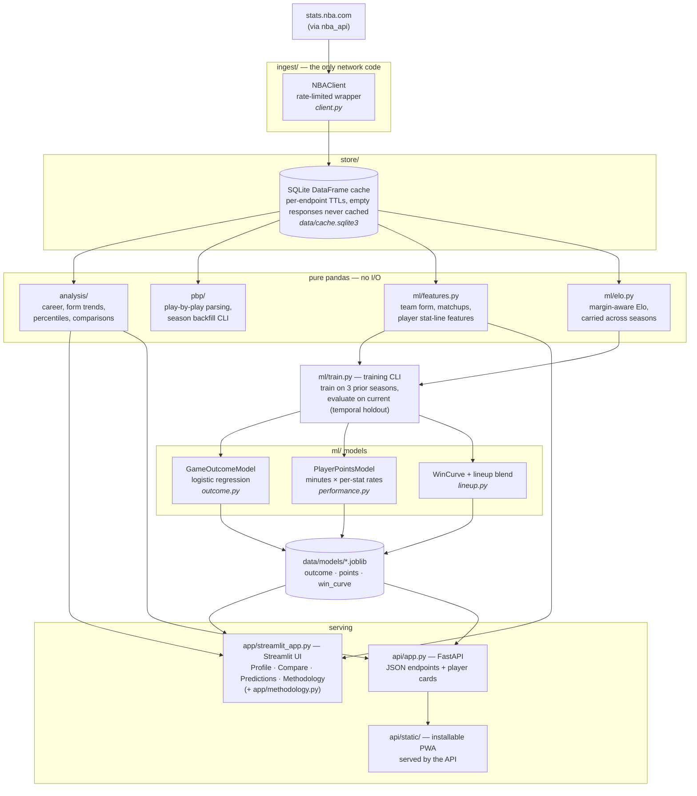

# Architecture

One rule holds everywhere: **the network is touched in exactly one place**
(`ingest.NBAClient`), every fetch goes through the SQLite cache, and
everything downstream of the cache is pure pandas — which is why the whole
test suite runs offline.

## Layer contracts

| Layer | Contract |
|---|---|
| `ingest/` | The **only** code that touches the network. Rate-limited `nba_api` wrapper; never called directly by the app layer. |
| `store/` | `Cache.get_or_fetch` fronts every remote call. Per-endpoint TTLs (current-season data refreshes daily); empty responses are never cached. |
| `analysis/`, `ml/features.py`, `pbp/` | Pure functions: DataFrames in, DataFrames out; `KeyError` on missing players/columns. No I/O, so tests stay offline. |
| `ml/train.py` | The evaluation protocol lives here: train on the three seasons before the current one, score on the current season as a true temporal holdout. The shipped artifacts are the ones whose numbers were printed. |
| `app/`, `api/` | Read through the cache and the saved artifacts only. The Streamlit app is the analyst-facing UI; the FastAPI app serves JSON plus the installable PWA. |

## Supporting pieces

- `config.py` — seasons, cache/model paths.
- `viz.py` — plotly half-court trace for shot charts.
- `warm.py` — cache warming.
- Column names follow stats.nba.com conventions (`PTS`, `GP`, `SEASON_ID`, …).
- Model artifacts (`data/models/`) and the cache are never committed; retrain
  with `uv run python -m nba_insights.ml.train`.
